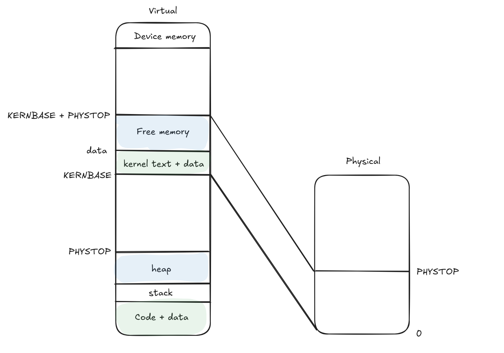
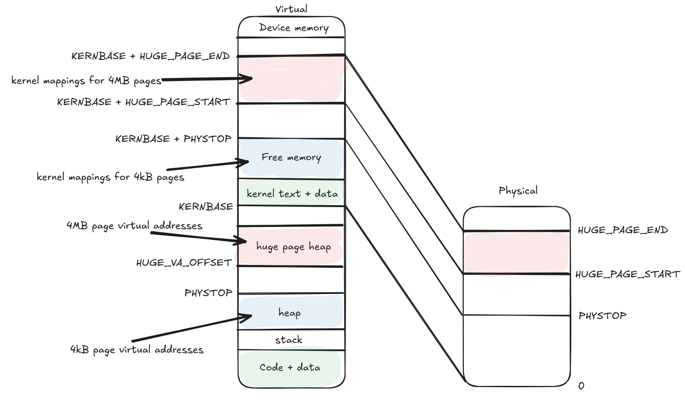
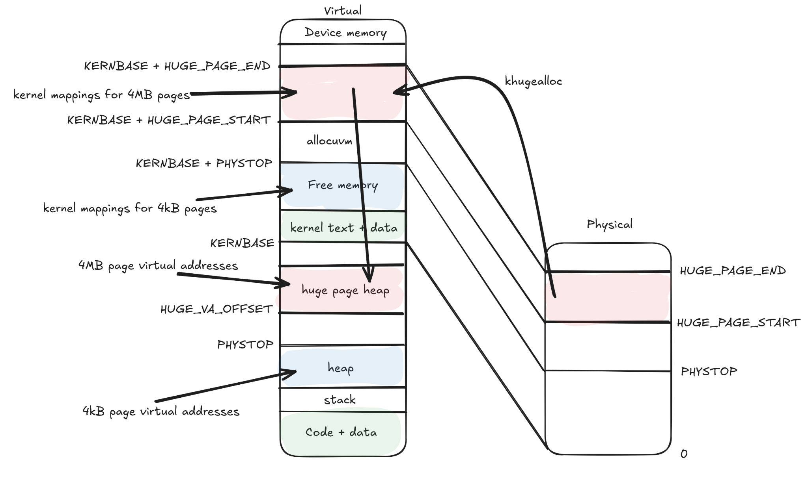
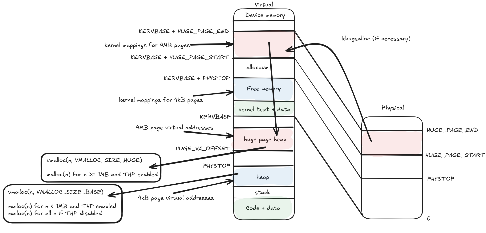

# CS537 Spring 2025, Project 4

## Learning Objectives

In this assignment, you will modify the memory management subsystem in xv6 to allow for user space allocation of 4MB pages. Your objectives for this assignment are as follows:

* Understand paging in xv6
* Understand the complexities of supporting multiple page sizes

You may work work with a partner for this project, and they do not need to be registered in the same lecture section as you.
This project is due on March 20, 2025 at 11:59 PM.

The work of this assignment is to:
* Allow users to manually allocate 4MB pages by implementing a user space allocator, vmalloc, based on umalloc code
* Modify the memory management subsystem in xv6 to transparently use 4 MB huge pages
* Add a system call, setthp to configure transparent huge page management

Some useful links:
[Chapter 2 of the xv6 manual (Page Tables)](https://pdos.csail.mit.edu/6.828/2018/xv6/book-rev11.pdf#Anchor%24toc%242d2)
[xv6 Memory Management Walkthrough](https://github.com/zarif98sjs/xv6-memory-management-walkthrough)

## Project Overview

### Step 1: Enable huge page allocations

Standard xv6 manages memory in 4 KB pages. For this assignment you will modify xv6 to support user space allocation of huge pages, which are **4 MB**. The first step is to support allocating both 4KB pages and 4MB pages.

By default, xv6 assumes the availability of 224 MB of physical memory - you can verify this by checking the value used to define PHYSTOP in memlayout.h

Huge pages must be allocated from physical addresses in the range 480 MB (0x1E000000) to 992 MB (0x3E000000). We have provided macros, HUGE\_PAGE\_START and HUGE\_PAGE\_END to demarcate the region of physical memory from which huge pages should be allocated.

Please look at the diagrams below - the first represents the layout of the virtual and physical address space for xv6 by default. The next image represents what the layout should look like after you have successfully implemented this project.

Original xv6 address space layout:



Layout with huge pages:



Your first task is to add functions to manage physical memory, analogous to kinit1, kinit2, kalloc and kfree in kalloc.c. Create new functions called khugeinit, khugealloc and khugefree to initialize huge pages, allocate physical memory and free pages.

Write a simple huge page allocator for huge pages. Understand how kinit1, kinit2, kalloc and kfree work for base pages, and implement khugealloc and khugefree. You can assume huge pages are only used for data pages - so you won't need to implement khugeinit1 and khugeinit2 - just one khugeinit function to initialize the freelist with huge pages from the physical address space reserved for huge pages.

Follow a similar API to kalloc and kfree for two reasons:
* Easy integration into xv6's memory management code: kalloc does not take any arguments, and when it is called, it simply returns a pointer to a 4kB page. This is then mapped using allocuvm in vm.c. Similarly, kfree takes in a single character pointer to an address, which it then adds to the free list. Both functions are used extensively in vm.c, which you will need to modify as the next step in this project
* kalloc and kfree have few dependecies on xv6 specific code: by following a similar design philosophy for khugealloc and khugefree, you should be able to test khugealloc and khugefree intially using an independent C program. Implement the alloc and free functions, initialize free region(s) in the free list, and then you can test kalloc and kfree.

### Step 2: Integration into the memory management subsystem
Once you have implemented the allocator and are confident in its functionality, it is time to integrate it into xv6. Do not forget to add initialization code similar to kinit and to guard operations in kalloc and kfree with locks.

Your ultimate goal is to add a user function, vmalloc, which allows users to explicitly allocate n bytes from either the base or the huge page heap.
You may base vmalloc of malloc, as defined in umalloc.c. vmalloc will accept two parameters - n, the number of bytes you want to allocate, and flag which will be passed a flag to determine whether we want to allocate memory using huge pages or base pages if memory needs to be allocated.

The flags can take two values, VMALLOC\_SIZE\_BASE and VMALLOC\_SIZE\_HUGE, which need to be defined in user.h. vmalloc will return a pointer to a virtual memory address where n bytes are available for use.

**Pay attention to the original umalloc code. The allocator manages the pool as a single data structure via the use of a pointer, freep and a value, base. Please update vmalloc to maintain two separate data structures: a pool strictly comprising of huge page data, and another for base page data.**

However, before implementing the allocator, you will need to make system level modifications. The userspace allocator uses the sbrk system call to obtain pointers to free data in the heap, which in turn calls growproc, which can call allocuvm and deallocuvm. You will need to modify these functions to be able to control where data is allocated.

On checking growproc and allocuvm, you will observe that you may not need to allocate memory if the user space allocator internally already has enough free space. The system does this with 4kB pages, extend the design to also apply to 4MB pages. For example, you may have allocated a huge page, only used 100kB out of 4MB, and then call vmalloc with the huge page flag for another 100kB, you should be able to determine that you have enough space available for this allocation.

Pay attention to the virtual addresses at which new data is allocated in growproc. Ensure that base pages and huge pages allocations are mapped to different parts of the virtual address space to avoid issues with page alignment.

By default, base page are mapped from virtual addresses 0-PHYSTOP (take a look at the functions malloc (umalloc.c), sbrk (sysproc.), grownproc (proc.c), allocuvm (vm.c) and kalloc (kalloc.c) to understand why.) Similarly, map huge pages starting from the virtual address HUGE\_VA\_OFFSET (defined in proc.h.) We have updated the proc structure to hold an additional parameter, hugesz, for this purpose.

Take a look at vm.c and determine what changes need to be made. While some changes may be obvious (adding cases to use khugealloc and khugefree in addition to kalloc and kfree) think about where else would you need to make changes related to huge pages.

For instance, you might need to update the process for mapping virtual addresses to physical addresses. How do PTEs and PDEs get affected by the addition of huge pages? Do huge pages need page tables and page table entries? **Make sure to mark the PDEs for huge pages with the PTE\_PS flag.**

After integrating the allocator and updating the memory management code, this is what the address space will look like, with annotations on how we expect address mappings from one region to another:



#### Use provided new system calls to monitor the effect of the changes
We have added two new system calls:
* procpgdirinfo, which keeps track of the total number of base and huge pages currently allocated by the process. The system call takes an array of two ints (just like how pipe does) as input and populates the value at indices 0 and 1 with the count of valid base and huge pages respectively.
* printhugpde, which prints out PDEs for huge pages.

### Step 3: Transparent Huge Page Allocation
vmalloc allows users to explicitly allocate base pages and huge pages. However, in the real world, users may not know the best situations to use pages of each type. Thus, many operating systems allow for enabling transparent huge page allocation (THP) where the OS automatically determines whether to allocate memory using huge pages based on heuristics.

For the sake of this assignment, you can assume that the THP system does not affect vmalloc (which is used when you want complete control over allocations.) Instead, it only affects allocations made using malloc. As a reminder, the syntax of malloc is malloc(n).

For cases where n < 1MB, we expect the user library to make the allocation using base pages, and if memory was previously allocated and the free pool contains some data from the base page region of the virtual address space, allocations must be made from there.

When n >= 1MB, we expect the allocation to be made using huge pages from the huge page region, either using memory from the allocator's pool that has to previously been allocated but is free (if available), or by allocating new memory.

In either case, if there is some free memory available in the corresponding pool, but it is not large enough to satisfy the entire allocation of n bytes, allocate a new page of the correct size based on n, i.e. allocate a huge page if n >= 1MB, else allocate a base page.

**Like with vmalloc, please update malloc to maintain two separate data structures when adding THP support: a pool strictly comprising of huge page data, and another for base page data.**

#### Adding a system call to control THP
Add a new system call, setthp(int). It will take an integer value as input; when this value is 0, THP is disabled, else it is enabled.

You will also want to add a system call to read the current value of the THP variable to help make policy decisions in user space, i.e. in umalloc.

At the end of the project, this is what the flow for user allocations should look like:



#### Error messages

If vmalloc is passed a flag that is not VMALLOC_SIZE_BASE or VMALLOC_SIZE_HUGE, it must print "Please pass VMALLOC_SIZE_BASE or VMALLOC_SIZE_HUGE as flag.\n" and then call exit()

If sbrk returns -1, both malloc and vmalloc should return 0. sbrk will return -1 in two cases:
* if the arguments passed are incorrect (this won't happen if you invoke the system call with the correct number and type of arguments)
* if allocuvm/hugeallocuvm is unable to allocate new pages or runs into trouble with mappings. allocuvm initially has two error messages, "allocuvm out of memory\n" and "allocuvm out of memory (2)\n"
    * you also need to add the error messages "hugealloc - allocuvm out of memory\n" and "hugealloc - allocuvm out of memory (2)\n" for similar cases when allocating huge pages.
    * allocuvm calls mappages - mappages may call panic if you try to remap an existing PTE. Have an analogous check when updating mappings for huge pages which will call panic, the message should be "hugepage - remap"

Also add a check to free/vfree - if the pointer passed has an address greater than KERNBASE, please print out the following error message "Error - trying to free a kernel pointer in userspace\n" and exit().

## Project Details

*   Your project should (hopefully) pass the tests we supply.
*   **Your code will be tested in the CSL Linux environment (Ubuntu 22.04.3 LTS). These machines already have qemu installed. Please make sure you test it in the same environment.**
*   Include a file called README.md describing the implementation in the top level directory. This file should include your name, your cs login, you wisc ID and email, and the status of your implementation. If it all works then just say that. If there are things which don't work, let us know. Please **list the names of all the files you changed in `solution`**, with a brief description of what the change was. This will **not** be graded, so do not sweat it.
*   Please note that `solution` already has a file called README, do not modify or delete this, just include a separate file called README.md with the above details, it will not impact the other readme or cause any issues. If you remove the xv6 README, it will cause compilation errors.
*   If applicable, a **document describing online resources used** called **resources.txt**. You are welcome to use online resources that can help you with your assignment. **We don't recommend you use Large-Language Models such as ChatGPT.**

* For this course in particular we have seen these tools give close, but not quite right examples or explanations, that leave students more confused if they don't already know what the right answer is. Be aware that when you seek help from the instructional staff, we will not assist with working with these LLMs and we will expect you to be able to walk the instructional staff member through your code and logic.
    * Online resources (e.g. stack overflow) and generative tools are transforming many industries including computer science and education.  However, if you use online sources, you are required to turn in a document describing your uses of these sources.
    * Indicate in this document what percentage of your solution was done strictly by you and what was done utilizing these tools. Be specific, indicating sources used and how you interacted with those sources.
    * Not giving credit to outside sources is a form of plagiarism. It can be good practice to make comments of sources in your code where that source was used.
    * You will not be penalized for using LLMs or reading posts, but you should not create posts in online forums about the projects in the course. The majority of your code should also be written from your own efforts and you should be able to explain all the code you submit.

## Suggested Workflow
- Implement and initialize physical memory allocator
- Modifications to memory management logic
- Modifications to sbrk, growproc. Implementing vmalloc.
- Create user programs, test system functionality with system calls provided
- Add THP support and control
- Test the system further! Look for bugs related to page alignment, mapping and address spaces


## Administrivia
- **Due Date** by March 20, 2025 at 11:59 PM
- Questions: We will be using Piazza for all questions.
- Collaboration: You may work with a partner for this project. If you do, you will also submit a partners.txt file with the cslogins of both individuals in your group when you turn in the project in the top-level directory of your submission (just like slipdays.) Copying code (from other groups) is considered cheating. [Read this](http://pages.cs.wisc.edu/~remzi/Classes/537/Spring2018/dontcheat.html) for more info on what is OK and what is not. Please help us all have a good semester by not doing this.
- This project is to be done on the [lab machines](https://csl.cs.wisc.edu/docs/csl/2012-08-16-instructional-facilities/), so you can learn more about programming in C on a typical UNIX-based platform (Linux).
- A few sample tests are provided in the project repository. To run them, execute `run-tests.sh` in the `tests/` directory. Try `run-tests.sh -h` to learn more about the testing script. Note these test cases are not complete, and you are encouraged to create more on your own.
- **Slip Days**:
  - In case you need extra time on projects, you each will have 2 slip days for the first 3 projects and 2 more for the final three. After the due date we will make a copy of the handin directory for on time grading.
  - To use a slip days or turn in your assignment late you will submit your files with an additional file that contains **only a single digit number**, which is the number of days late your assignment is (e.g. 1, 2, 3). Each consecutive day we will make a copy of any directories which contain one of these `slipdays.txt` files.
  - `slipdays.txt` must be present at **the top-level directory** of your submission.
  - Example project directory structure. (some files are omitted)
  ```
  p4/
  ├─ solution/
  │  ├─ README.md
  │  ├─ usertest.c
  │  ├─ Makefile
  |  ├─ (rest of xv6, with your modifications)
  ├─ tests/
  ├─ README.md
  ├─ slipdays.txt
  ├─ partners.txt
  ```
  - We will track your slip days and late submissions from project to project and begin to deduct percentages after you have used up your slip days.
  - After using up your slip days you can get up to 80% if turned in 1 day late, 60% for 2 days late, and 40% for 3 days late, but for any single assignment we won't accept submissions after the third days without an exception. This means if you use both of your individual slip days on a single assignment you can only submit that assignment one additional day late for a total of 3 days late with a 20% deduction.
  - Any exception will need to be requested from the instructors.

  - Example of `slipdays.txt`:

```sh
$ cat slipdays.txt
1
```

## Submitting your work
- Run `submission.sh`
- Download generated tar file
- Upload it to Canvas
  * Links to Canvas assignment (update):
  * [Prof. Mike Swift's class](https://canvas.wisc.edu/courses/434150/assignments/2641726)
  * [Prof. Ali Abedi's class](https://canvas.wisc.edu/courses/434155/assignments/2641727)
